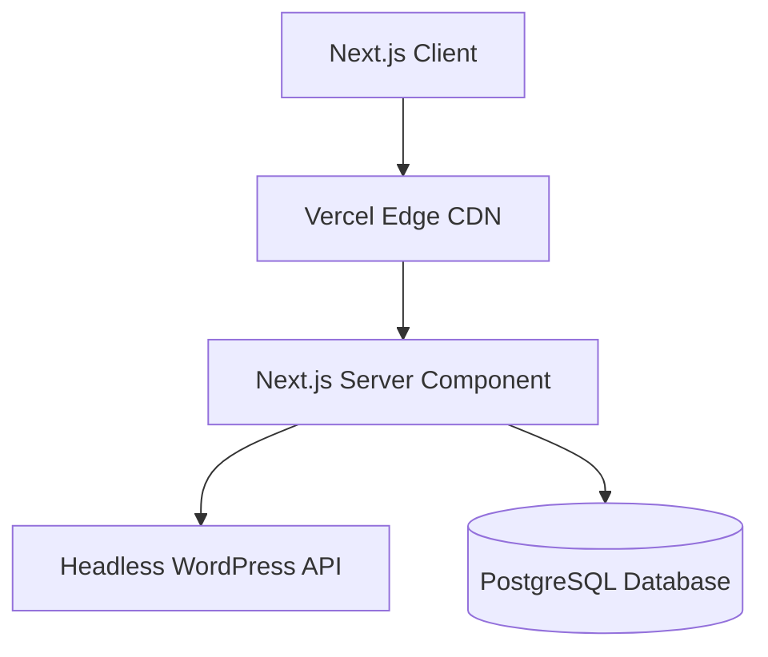

# Content Strategy & Copywriting Guide

This document defines how text, bio data, skills, and project case studies are structured, written, and dynamically served depending on the active user persona.

---

## 1. Persona Copywriting Matrix

To build trust quickly with target hiring managers, the page narrative must adjust when a specific persona is selected.

| Persona                            | Primary Focus                                                               | Headline Pitch                                               | Example Bio Statement                                                                                                         |
| :--------------------------------- | :-------------------------------------------------------------------------- | :----------------------------------------------------------- | :---------------------------------------------------------------------------------------------------------------------------- |
| **Software Engineer** (Generalist) | Algorithms, SOLID principles, clean code patterns, problem-solving.         | "Building Scalable, Maintainable Software Solutions"         | "Software engineer specialized in clean architectural patterns, data structures, and robust unit testing."                    |
| **Backend Engineer**               | APIs, DB schemas, system design, performance, security.                     | "Designing High-Throughput APIs and Distributed Systems"     | "Backend specialist with deep experience in Node.js, relational databases, caching systems, and containerized deployments."   |
| **Full Stack Developer**           | Complete products, UX integration, component design, responsive interfaces. | "Crafting Seamless End-to-End User Experiences"              | "Full stack developer combining pixel-perfect CSS with performant serverless backends to build high-converting interfaces."   |
| **WordPress Engineer**             | Themes, custom plugins, Gutenberg blocks, headless architecture.            | "Architecting Modern, Headless and Custom WordPress Systems" | "WordPress engineer dedicated to custom PHP plugin engineering, clean blocks development, and headless Next.js integrations." |

---

## 2. Standardized Project Case Study Template

Every project detail page (or case study view) must follow a structured, technical storytelling template using the **STAR** (Situation, Task, Action, Result) methodology.

### Case Study Structure

````markdown
# [Project Name] — [Short, Impactful Tagline]

## 1. Executive Summary

A 3-sentence summary of what the project is, the core technologies used, and the primary business or technical result achieved.

## 2. Technical Stack Showcase

- **Frontend**: e.g., Next.js, React, CSS Modules
- **Backend/Database**: e.g., PostgreSQL, Redis, Node.js, Express
- **WordPress/CMS**: e.g., Headless WP REST API, Custom Block Library
- **Infrastructure**: e.g., Docker, AWS ECS, Vercel

## 3. The Challenge (Situation & Task)

Detail the engineering problem or business need.

- _Example_: "The existing WordPress system was slowing down checkout times by 4.2 seconds due to heavy database queries and excessive third-party plugins."

## 4. System Architecture & Database Design (Action)

Include mermaid flowcharts detailing system interactions or database schema layout.


````

### 5. Implementation Deep-Dive

Present a critical block of code demonstrating high-quality software craftsmanship (e.g., custom WP plugin filter, Next.js API rate limiter, SQL query optimization).

_Example Snippet_:

```typescript
// Custom hook optimizing render cycles for list filter selection
export function useOptimizedFilter<T>(items: T[], filterKey: keyof T) {
  // Logic implementation here...
}
```

## 6. Engineering Results (Result)

Quantifiable metrics demonstrating success.

- "Reduced API latency by **42%** through redis caching."
- "Achieved **100/100** Google Lighthouse scores on desktop/mobile."
- "Eliminated runtime exceptions by reaching **98%** TypeScript type coverage."

```

---

## 3. Skills Matrix Categorization

Technical skills must be cataloged inside the application config with strict categorization tags:

- **Core languages**: TypeScript, JavaScript, PHP, SQL (PostgreSQL/MySQL).
- **Frontend Frameworks**: React, Next.js.
- **Backend & APIs**: Node.js, Express, REST APIs, GraphQL, Serverless Functions.
- **CMS & Custom Dev**: WordPress Theme Dev, Gutenberg Block Dev, Custom Plugin Architecture, WP-CLI, Advanced Custom Fields (ACF).
- **DevOps & Cloud**: Docker, Git, CI/CD Actions, AWS S3, Vercel, Netlify.
```
