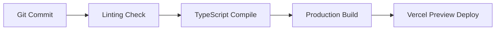

# Deployment Strategy & Operations

This document outlines the hosting architecture, build steps, CI/CD automation pipeline, and operational monitoring rules for the portfolio.

---

## 1. Hosting Architecture

The portfolio is architected as a **Next.js serverless application** deployed on **Vercel** to take advantage of edge page caching and serverless API executions.

- **Frontend Assets**: Statically generated and distributed via Vercel's Global Edge Network (CDN).
- **Serverless API Routes**: Hosted as serverless Node.js lambdas (or Edge functions where latency matters).
- **Caching**: Employs **Incremental Static Regeneration (ISR)** for CMS and project listings, revalidating page content in the background every 24 hours without requiring complete re-builds.

---

## 2. CI/CD Workflow Pipeline

We enforce automatic quality assurance checks on every code commit and pull request.

### Action Configuration (GitHub Actions / Vercel Integrations)

1. **Static Analysis & Linting**:
   - Runs `eslint` and `prettier` formatting validations.
   - Command: `npm run lint && npm run format:check`
2. **Type Safety Validation**:
   - Ensures zero compile-time TypeScript errors.
   - Command: `npm run typecheck`
3. **Build Compilation**:
   - Runs the Next.js production build to verify bundles.
   - Command: `npm run build`
4. **Deploy Previews**:
   - On pull requests, Vercel deploys a sandboxed version of the branch with a unique preview URL.
   - Run automated Lighthouse performance audits against the preview URL. If performance falls below 90, the build warns the team.

---

## 3. Environment Variables Configuration

The following parameters must be configured in Vercel's environment variables dashboard for local development, staging, and production environments:

| Variable Name             | Environment        | Description / Target Value                                                  |
| :------------------------ | :----------------- | :-------------------------------------------------------------------------- |
| `NEXT_PUBLIC_SITE_URL`    | All                | Base canonical URL (e.g., `https://myname.dev`)                             |
| `RESEND_API_KEY`          | Production/Staging | Token from Resend service to dispatch contact form emails.                  |
| `CONTACT_EMAIL_RECIPIENT` | Production         | Destination email address to receive contact form submissions.              |
| `WORDPRESS_API_URL`       | Production         | REST or GraphQL endpoint of the headless WordPress database (if connected). |

---

## 4. Operational Monitoring & Analytics

- **Performance Tracking**: Vercel Speed Insights is enabled to capture Real User Monitoring (RUM) metrics directly from live visitor sessions.
- **Error Tracking**: Integration with Sentry (or log drains) to monitor client-side React rendering failures and serverless lambda exceptions.
- **Uptime Alerts**: A simple ping checker (e.g., Better Stack, UptimeRobot) is pointing to `/api/healthcheck` to monitor site availability.
